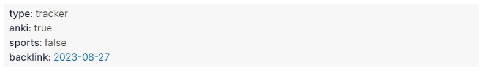
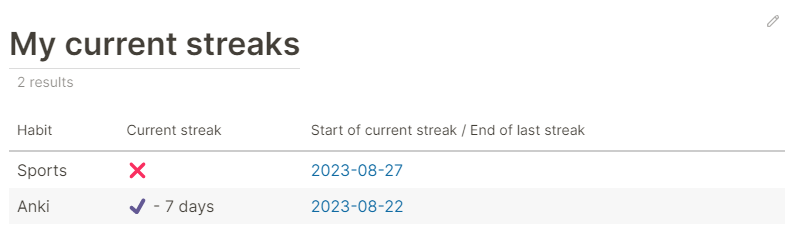
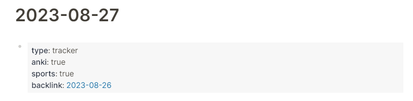

# Tracking your habit streaks with advanced queries in logseq

In this tutorial, I will walk you through an advanced query in logseq that keeps track of your habit streaks. This tutorial is mainly intended for educational purposes as the query itself is not efficient. We will cover the basic syntax for advanced queries, including the `input:` and `rules:` clauses, as well as definitions of recursive rules and producing a table view with HTML hiccups. Furthermore, we will cover a way to count occurences based on conditions. Logseq uses datalog for the advanced queries and if you have not yet read the [learndatalogtoday tutorial](https://www.learndatalogtoday.org/) I highly encourage you to do it now.

## The habits block

The idea is based on this [blog post](https://agj.bearblog.dev/habit-tracking-in-logseq/): the tracking itself happens in the journal days in a specific block with the property `type` being set to `tracker`. This blog will contain one property for each habbit that you want to track. In the example below, we track the daily sport activities and our [Anki](https://apps.ankiweb.net/) usage. Furthermore, we will have one more property in this block, `backlink`. This property is a link to the journal entry of the previous day and it will come in handy later. As of the writing on 2023-08-28, I have done my daily round of Anki, but I haven't been out for sports yet. Therefore, my habits block on the daily journal page looks like this:



To automate the creation of the habit block and especially the `backlink`, I have added the following block to my daily journal template. By default the hobbies are set to false.

```
type:: tracker
anki:: false
sports:: false
backlink:: <% yesterday %>
```

Next, let's take a look at what my habit streaks for this day look like.



My tracker shows that I am on a 7 days streak with Anki that started on 2023-08-22. Furthermore, it shows me that the last time I made some sports was yesterday, as can be seen by this entry for 2023-08-27.



## The advanced query

The above table is created by this advanced query:

```clojure
{
 :title [:h1 "My current streaks"]

 :query
 [
  :find (count ?p) (sum ?habit-today) ?habit-name (min ?date)
  :keys count today habit lastdate
  :in $ ?today [?habit ...] [[?habit2 ?habit-name]] %

  :where
  [(= ?habit ?habit2)]
  [?p_today :block/journal-day ?today]
  [?p_today :block/journal? true]
  (or-join [?p ?p_today ?habit  ?habit-today ?date]
   (and 
    (pages-next-day ?p ?p_today ?habit true)
    [?b2 :block/refs ?p]
    [test-property ?b2 :type "tracker"]
    [?b2 :block/page ?p2]
    [(ground true) ?habit-today]
    [?p2 :block/journal-day ?date2]
    [?p2 :block/original-name ?name2]
    [(vector ?date2 ?name2) ?date]
   )
   (and
    (pages-next-day ?p ?p_today ?habit false)
    [(ground false) ?habit-today]
    [?p :block/journal-day ?date_]
    [?p :block/original-name ?name]
    [(vector ?date_ ?name) ?date]
   )
  )
 ]
 :inputs [:today [:anki :sports] [[:anki "Anki"] [:sports "Sports"]] ]
 :rules [
 ;; similar to predefined property rule
  [(test-property ?b ?type ?testval)
   [?b :block/properties ?props]
   [(get ?props ?type) ?val]
   [(== ?val ?testval)]
  ]
  ;; check whether specific habit was done in tracker block
  [(habit-block ?b ?habit ?val)
   [test-property ?b :type "tracker"]
   [test-property ?b ?habit ?val]
  ]
  
  [(pages-next-day ?p1 ?p2 ?habit ?val)
   ;; fastest when we begin search at the known page ?p2
   [?b2 :block/page ?p2]
   (habit-block ?b2 ?habit ?val)
   [?b2 :block/refs ?p1]
   [?p1 :block/journal? true]
  ]
  [(pages-next-day ?p1 ?p2 ?habit ?val)
   ;; fastest when we begin search at the known page ?p2
   [?b2 :block/page ?p2]
   (habit-block ?b2 ?habit ?val)
   ;; ?px is the page that ?p2 links to.
   ;; Is it connected to ?p1? If yes, then ?p1 and ?p2 are also connected.
   [?b2 :block/refs ?px]
   [?px :block/journal? true]
   (pages-next-day ?p1 ?px ?habit ?val)
  ]
 ]
 :view (fn [rows] [:table
  [:thead
   [:tr
    [:th "Habit"]
    [:th "Current streak"]
    [:th "Start of current streak / End of last streak"]]]
  [:tbody
   (for [ r rows] [:tr
    [:td (get r :habit)]
    [:td (if (> (int (get r :today)) 0)
     (+ "✔️ - " (get r :count) (if (> (int (get r :count)) 1) " days" " day"))
     "❌")
    ]
    [:td
     [:a
      {:href
       (str "#/page/" (nth (get r :lastdate) 1))
      } (nth (get r :lastdate) 1)
      ]
    ]
   ])
  ]
 ])
}
```

### Structure of the query

The above query is entirely enclosed by curly brackets. It is coarsely structured by keywords that we will briefly discuss. You can use [hiccup](https://cljdoc.org/d/reagent/reagent/1.2.0/doc/tutorials/using-hiccup-to-describe-html) within the `:title` to quickly explain your query. Next comes the datascript `:query` enclosed by square brackets. It describes which information the query will return, which generic inputs (similar to function arguments) the query expects, and the search logic of our query. The `:input` keyword is used to describte the actual variables that are given to the query as arguments. In the `:rules` part, custom made rules are defined. Rules are analogous to functions or routines in other languages; they are used when the same query logic needs to be used repeatedly. Furthermore, they allow to apply the same logic iteratively, which is exactly what we will leverage. Finally, the `:view` keyword receives a function that describes how the information of the query is nicely formated for display.

### Overall concept

The basic concept of the above query is similar to [chapter 8](https://www.learndatalogtoday.org/chapter/8) of the learndatalogtoday tutorial. Through the `backlink` property, all our journal pages are linked together in a sequential list. However, we are not interested in the endless sequential list, rather we are only interested in the uninterrupted sequence of journal pages. We use a recursive rule that exactly finds all pages that belong to this uninterrupted sequence. Once we have them, we just need to count them to find the length of the current streak.

### Start of `:query`

The `:title` part is self-explanatory, so let's start directly with the beginning of the query part.

```clojure
 :query
 [
  :find (count ?p) (sum ?habit-today) ?habit-name (min ?date)
  :keys count today habit lastdate
  :in $ ?today [?habit ...] [[?habit2 ?habit-name]] %
```

The `:find` statement defines four bound variables `?p`, `?habit-today`, `?habit-name`, and `?date`. We are using three aggregate functions `count`, `sum`, and `min`. With the `:keys` statement, we can define names for the return values so that we can specifically select these values in the `:view` statement. Based on the `:in` statement, the query expects the following inputs. The `$` describes the basic input of a database and is not interesting. Next, we have one input variable `?today` with which we let the query know which date we have today. Next comes a collection of the habits that we want to track and a relation that is used to translate the queried habits into a displayable string. The `%` in the end of the line demarks the rules that are inputed.

### The `:where` clause.

The `:where` clause is part of the `:query` and defines the highlevel logic of finding an uninterrupted sequence of days. Let us start with the first part of this clause.

```clojure
  :where
  [(= ?habit ?habit2)]
  [?p_today :block/journal-day ?today]
  [?p_today :block/journal? true]
```

In the first line, we are searching for journal pages `?p`. In the second line, we want that the values of `?habit` and `?habit2` are equal. Don't bother if you do not understand this line yet. It will be covered in the explanation of the relation in the `:in` and `:input` statement. In the next two lines, the journal page of today's date is bound to the variable `?p_today`.

### `or-join` to count different conditions

Next, we are going to use an [`or-join`](https://docs.datomic.com/cloud/query/query-data-reference.html#or-join) clause that allows us to count two different cases. Either, the habit is ticked as done today or not. If it is ticked as done today, we want to know the length of the current streak. If the habit was not yet done, we want to know when we last did that habit. This second question can equally be framed as searching an uninterrupted sequence of days where the habit was *not* done. We will employ a scheme that is also described in this [stackoverflow answer](https://stackoverflow.com/a/47417128/10106730). In the `:find` statement we used the aggregation `(count ?p)` which will give us the correct length of the positive and negative streaks. Therefore, we need to define a new variable that determines in which part of the `or-join` clause we counted. This new variable is `?habit-today` and we saw it previously in the `:find` statement where we used the `sum` aggregation for it.

Before we jump into the specifics of the `or-join` clause, I want to mention two minor details. Recall, first, that those conditions within the `or-join` that need to be connected by and-logic need to go into an `and`clause. Second, the `[?p ?p_today ?habit  ?habit-today ?date]` defines which variables within the `or-join` clause are bound to variables defined outside of the clause. All other variables within the `or-join` clause are not available outside of it.

#### Detecting a positive streak

```clojure
  (or-join [?p ?p_today ?habit  ?habit-today ?date]
   (and 
    (pages-next-day ?p ?p_today ?habit true)
    [?b2 :block/refs ?p]
    [test-property ?b2 :type "tracker"]
    [?b2 :block/page ?p2]
    [(ground true) ?habit-today]
    [?p2 :block/journal-day ?date2]
    [?p2 :block/original-name ?name2]
    [(vector ?date2 ?name2) ?date]
   )
```

The first condition in the `and` clause is a custom defined rule. We will look at that rule in more detail later. For now it suffices to know, that the rule expects identifiers for two journal page entries, `?p` and `?p_today`. It checks, whether the two days are consecutive days, or linked to each other by other consecutive days based on the fact that the habit in question (defined by `?habit`) is `true` on the two days and on all days in between. If that is true, then the habit was done today, and we set `?habit-today` to `true` with the `ground` function. These two lines suffice to count the length of the current streak.

The other lines are needed to get the date that this streak was started. In order to do so, we search for the habit block `?b2` in the journal page `?p2`

#### Detecting a positive streak

```clojure
   (and
    (pages-next-day ?p ?p_today ?habit false)
    [(ground false) ?habit-today]
    [?p :block/journal-day ?date_]
    [?p :block/original-name ?name]
    [(vector ?date_ ?name) ?date]
   )
  )
 ]
```

Efficiency of recursive rules:
- [Put the most selective clause first in query](https://docs.datomic.com/pro/best-practices.html#most-selective-clauses-first)
- [Join along](https://docs.datomic.com/pro/best-practices.html#join-along)
- Develop more selective clauses from where you come from.
